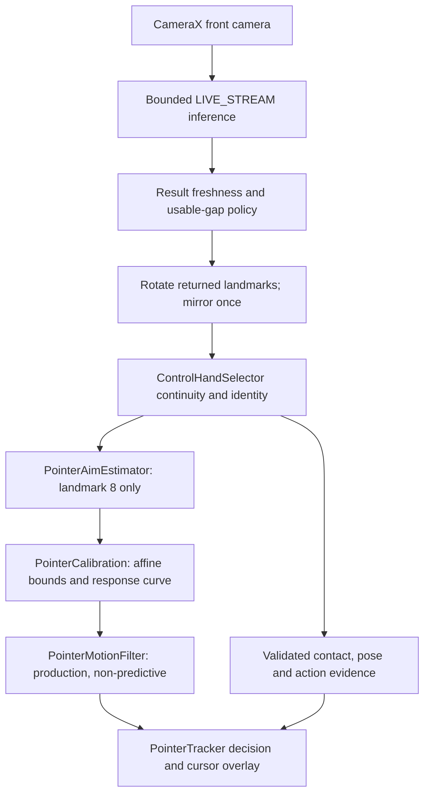
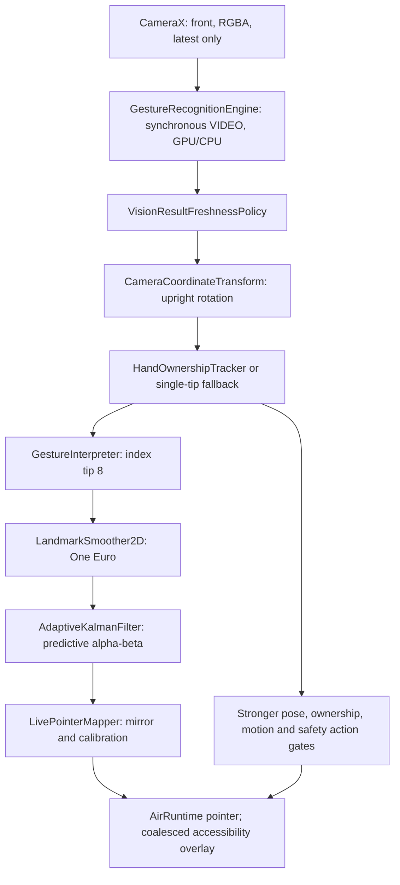

# Aergis pointer lineage recovery — 7 October 2026

## Scope and evidence

The development reference is `coderPSR-940402/Aergis_main@aa890f4437e0289a0974efe6c62d06b406e68983`, verified as both main and `baseline-successful-apk`. Its Aergis CI run [37588570567](https://github.com/coderPSR-940402/Aergis_main/actions/runs/37588570567) completed successfully. Historical repositories were read only.

The primary historical reference is [AERMOTUS@92eb773ab516df8955f987b874c6041b4d6e8cb2](https://github.com/AERMOTUS-9404025043089/AERMOTUS/tree/92eb773ab516df8955f987b874c6041b4d6e8cb2). Its build configuration specifies `0.18.24-preview`, version code 49, package `com.airgesture.control`, and the same pinned MediaPipe gesture model SHA-256 as current Aergis. The supplied APK's association with this commit and its superior physical performance are user-provided evidence; this investigation did not independently attest the supplied APK's binary/source equivalence.

This is a testable recovery candidate. It does not establish that the lower-screen or fast-motion problems have been physically fixed. Current filtering remains the initial default; VC49 is explicitly selectable for physical comparison, with both candidates recorded simultaneously. No synthetic score automatically selects a default.

## A. Repository lineage

GitHub repository searches were run under both connected identities, and each named reference was inspected. This lists relevant repositories found through those accessible accounts; it does not claim access to deleted or unconnected repositories.

| Repository | Verified role | Pointer evidence |
|---|---|---|
| [coderPSR-940402/Aergis_main](https://github.com/coderPSR-940402/Aergis_main) | Current product and implementation target | Current engine, safety, ownership, calibration, replay, GPU fallback, diagnostics, and CI |
| [mrpsrabe-coder/AIR-GESTURE-CONTROL](https://github.com/mrpsrabe-coder/AIR-GESTURE-CONTROL) | Earlier private lineage | Current snapshot uses palm/MCP translation anchor and bounded age prediction; not the desired vc49 authority contract |
| [mrpsrabe-coder/AERMOTUS](https://github.com/mrpsrabe-coder/AERMOTUS) | Separate private lineage | Current snapshot follows fingertip with anatomy/straightness/bend-conditioned acceptance; still contains predictive filtering; requested vc49 commit is not in this repository |
| [AERMOTUS-9404025043089/AERMOTUS](https://github.com/AERMOTUS-9404025043089/AERMOTUS) | Primary behavioral reference | Exact requested commit verified through historical account; direct landmark 8 authority, calibrated non-predictive production filter, separate contact channel |
| [AERGISAIRG/Aergis](https://github.com/AERGISAIRG/Aergis) | Public organization lineage discovered by name search | Direct landmark-8 estimator and R18 kinematic filter; read access only under current account; no superior device evidence |
| [AERGIS-airges/AirGestureControl_Aergis](https://github.com/AERGIS-airges/AirGestureControl_Aergis) | Public organization lineage with current-account administrative access | Direct landmark-8 estimator and R18 kinematic filter; candidate for later comparison |
| [coderPSR-940402/RABEDEV-AERGIS](https://github.com/coderPSR-940402/RABEDEV-AERGIS) | Later historical experiment | Keeps narrow landmark-8 estimator but replaces production filter with `PointerKinematicFilter` (R18); benchmark first, no physical evidence supplied that it beats vc49 |

Reference repository tree snapshots inspected: AIR-GESTURE-CONTROL `0542cced84b0f97336bd1c409e5061209ed4601d`; mrpsrabe-coder/AERMOTUS `4423f70a5eabea226d458b7c8c394803652d23e2`; RABEDEV-AERGIS `fd12aa6ff23a02053c4ed27b656bdc9ee9b0534c`. Additional trees: AERGISAIRG/Aergis `6c6a7b7d2b0cc57c2096ab6d12c782f01fbc9d5d`; AERGIS-airges/AirGestureControl_Aergis `d4cc023ffbc42e976dda38ca6e55b92ede4659a2`. These are tree object IDs, not claimed APK source commits. The organization demo-repository is not a pointer product and is excluded.

## B. Runtime comparison

### vc49: actual production path

`GestureCaptureService.handleResult` constructs canonical landmarks, aspect-corrected candidate geometry, palm identity signatures, and continuity-vetted hand selection. Only the selected hand's landmark 8 enters `PointerAimInput`. `PointerTipContactEstimator` separately measures index-tip/middle-tip contact, using validated world geometry when available and aspect-corrected image geometry otherwise. `PointerTracker` maps calibration before the production motion filter. Its click state may snapshot an action target; it does not redirect pointer X/Y to palm landmarks.

The production filter uses speed-adaptive exponential smoothing, continuous micro-jitter damping, and quick confirmation of large moves. A One Euro candidate and `PointerFilterBenchmark` run in shadow, not as the live cursor. `VisionFramePacer`, `VisionLatencyPolicy`, `VisionPerformanceMonitor`, and `VisionPipelineBenchmark` are runtime monitoring/pacing policies. Inference can use direct media images with a bitmap fallback; the bounded live-stream policy admits up to two submitted frames.

After 130 ms of hand loss, vc49 hides the cursor and cancels presence/action state while retaining filter state. `ControlHandSelector` retains identity longer (default lost-reset window 650 ms); explicit control-hand discontinuity resets the filter. `UsableVisionGapPolicy` provides a hard stale-data fail-safe. These are distinct policies, not unlimited cursor continuation.

`TrackingMirrorBridge` differs by build type: debug has diagnostic implementation, release has a stub. A filename containing "r8-filter-shadow" does not itself prove Android R8 minification; the exact historical build configuration disables release minification.

### Current main at the verified baseline

Runtime details:

1. `GestureCaptureService` requests RGBA analysis, target resolution 960×540, `KEEP_ONLY_LATEST`, and calls `GestureRecognitionEngine.analyze` before closing each image.
2. MediaPipe `recognizeForVideo` receives `ImageProcessingOptions.rotationDegrees`. Returned image coordinates are then rotated once into upright space by `CameraCoordinateTransform`; front-camera mirroring occurs once in the mapper. The mirror's skeleton/image are separately rotated and mirrored for preview; this does not feed pointer coordinates back into inference.
3. Handedness labels swap Left/Right. Command ownership uses wrist position, index/pinky MCP width, short velocity history, a 0.22 center-distance gate, a 0.6 size-delta gate, and an ambiguity margin. Fallback pointer selection requires exactly one eligible finite tip and never establishes command ownership.
4. `GestureInterpreter` evaluates pose geometry. At baseline, the bone constraint is called only for accepted geometry. Both the pose gate and constraint use the same 1.35 maximum ratio, so the constraint normally cannot modify accepted tips. It is not established as the lower-screen cause. The recovery code removes this redundant positional dependency explicitly.
5. Baseline pointer filtering is One Euro (`minCutoff=1.5`, `beta=0.15`) followed by predictive alpha-beta (`positionGain=0.82`, `velocityGain=0.34`). The latter clamps measured/predicted/output coordinates to [0,1], limits innovations, and cold-starts after gaps over 250 ms. There is no additional engine-side filter, and the old depth-compensation warp is absent.
6. Mapping happens after these filters. Default uncalibrated mapping uses 0.02–0.98 bounds; enabled profiles use their persisted affine bounds/curves. Comfortable reach is a separate profile, including bottom=0.65. Saturation outside chosen bounds is expected mapping behavior, not proof of a detector dead zone.
7. Pointer activity requires enabled, ARMED, and SAFE foreground. Phone motion blocks actions but does not kill pointer movement. Pose rejection cancels action history while retaining finite-tip cursor tracking.
8. At baseline, empty detections coast for 130 ms; expiry resets ownership/interpreter. Non-finite selected tips and any freshness rejection immediately reset/hide. Ownership generation changes do not explicitly reset the interpreter filter.
9. Pointer coordinates are published before action dispatch. Accessibility snapshots coordinates at request time and rechecks the action epoch before injecting. Overlay rendering is coalesced on the main thread. Pending screen injection and completed Android dispatch are distinct results.

`PointerController` and `ClickManager` are not called by this runtime. Their behavior is not treated as evidence of installed pointer motion. Replay/mapping comparison classes are harnesses; they are not extra live pointer filters.

### Recovery candidate

The current safety and camera chain is retained. Position is explicitly landmark 8. CURRENT keeps its existing two-filter motion path; VC49 maps the same raw tip through the same current calibration and then applies the recovered non-predictive production math. Both outputs are observable simultaneously. Mode/owner/calibration/safety discontinuities clear state; brief missing/non-finite results cancel actions immediately and retain only cursor visibility for at most 130 ms. History can survive a safe same-owner loss up to 500 ms; ambiguity and safety transitions clear it.

CURRENT's internal alpha-beta cold-start after 250 ms remains part of its measured behavior. VC49 retains its shock guard across the longer safe identity interval. This asymmetry is intentional comparison evidence, not hidden double smoothing in the VC49 cursor.

## C. Symptom and root-cause table

| Physical symptom | Evidence-backed classification | What is established / still unknown |
|---|---|---|
| Severe lower-screen disappearance | Raw detector dropout, non-finite tip, hand selection, or overlay must be separated | No dedicated lower-Y hide threshold exists in baseline engine. Pose rejection alone does not suppress a finite eligible tip. Raw presence at failure is not known without device recording. |
| Loss during fast movement | Raw dropout + immediate invalid-tip hide; possible ownership rejection | Invalid-tip removal reproduced in actual engine integration test. Ownership gates can reject large wrist changes, but single-hand fallback usually keeps pointer movement. Record selection/rejection before widening gates. |
| Lag | Two smoothing stages, low One Euro cutoff, inference/render delays | Both filters are live; alpha-beta predicts from already-smoothed input. Magnitude and physical end-to-end latency require A54 measurement. |
| Jumpiness / stationary jitter | Detector noise, prediction, filter reset, hand replacement | Baseline prediction can overshoot; some ownership changes inherit filter state. Recovery explicitly resets on owner/handedness changes and compares non-predictive output. |
| Edge dead zones | Calibration saturation or detector field of view | Affine bounds and curves are known; raw dropout cannot be inferred from a saturated screen coordinate. No new arbitrary edge clamp is introduced. |
| Inconsistent depth sensitivity | Changed detector geometry, ownership scale evidence, calibration, filter | Old depth warp is absent; palm bone constraint normally cannot change accepted tips. Neither is asserted as the current cause. |
| Historical swapped axes / mirroring | Previously corrected coordinate conversion | Current rotation→mirror order matches vc49. Preserve current transform; test portrait/landscape and log frame rotation. No second live rotation/mirror added. |
| Teleport on reacquisition | Full state reset after cursor-grace expiry | Baseline discarded filter history after 130 ms. Recovery hides at the same deadline but retains safe identity/filter history longer; commands remain cancelled. |
| Click drift | Contact gesture moving measured tip, filter response, render/request timing | Current click target snapshots avoid later queued-coordinate substitution. Logs now include actual overlay application and action-request targets. Historical contact model is not copied before device evidence. |
| Right/bottom edge tap failure | Accessibility uses exclusive display width/height endpoints | Historical `PointerScreenCoordinateMapper` correctly clamps to width−1/height−1. This remains a separately identified follow-up; it is not misreported as a pointer-disappearance fix. |

## D. Recovery matrix

| Historical component/principle | Decision | Reason |
|---|---|---|
| `PointerAimEstimator`, landmark-8-only API | Adapt | Remove redundant palm constraint from current position path; retain current tip validity handling. |
| `PointerMotionFilter` vc49 | Benchmark first; restored as selectable candidate | Preserve proven math/constants for comparison, omit historical nested One Euro shadow workload. Add finite/monotonic boundary protection. No automatic default change. |
| `PointerTracker` visibility/filter continuity | Adapt | Retain 130 ms cursor grace, immediately cancel action evidence, preserve safe same-owner history up to 500 ms. Do not import its entire click/navigation machine. |
| `PointerTipContactEstimator` | Benchmark first | World/aspect-correct contact is promising; changes click thresholds/semantics. Current action safety remains authoritative. |
| `PointerScreenCoordinateMapper` | Restore in a separate incremental fix | Confirmed exclusive-edge dispatch issue; avoid conflating with detector disappearance. |
| `PointerCalibration` / activity | Retain current, adapt principles | Current persistence, comfortable-reach preset, live edits, hand/orientation profiles are already available. |
| `ControlHandSelector`, `HandIdentitySignature` | Adapt selectively later | Historical signatures help distinguish same-handed replacements; current ownership/action gates should not be replaced without A/B evidence. |
| `WorldHandGeometryValidator` | Retain current pointer independence; benchmark action use | Anatomy/world validation is useful for gestures/identity, not alternate pointer X/Y. |
| `UsableVisionGapPolicy` | Adapt separation of cursor and action recovery | Current freshness policy remains; cursor-only retention no longer requires all action state to survive. |
| `VisionCoordinateMapper` | Retain current | Current rotation followed by mapper mirror is equivalent; prevent double application. |
| `VisionFramePacer` / `VisionLatencyPolicy` | Benchmark first | Historical bounded LIVE_STREAM differs materially from current synchronous VIDEO; do not transplant inference architecture without measured cadence/thermal evidence. |
| `VisionPerformanceMonitor` / `VisionPipelineBenchmark` | Adapt telemetry | Preserve exact timings, result age, delegate, diagnostic overhead, and recorder drops. Source-clock timestamp is recorded without claiming a verified camera-to-uptime conversion. |
| `TrackingMirrorBridge` | Retain current; improve evidence | Existing optional movable/removable mirror is extended with selected hand, raw/mapped/final coordinates and rejection state. |
| Old palm-translation/straightness position steering | Discard | Violates reference positional authority and has no supplied superior device evidence. |
| `RABEDEV-AERGIS` R18 kinematic filter | Benchmark first | Newer historical code alone is not evidence of superior behavior. |

## E. Implementation and diagnostic contract

Implementation is on [PR 39](https://github.com/coderPSR-940402/Aergis_main/pull/39), directly in the target repository. Main and the verified baseline remain unchanged pending the physical comparison.

- `GestureRecognitionEngine` handles cursor-only gaps, explicitly resets on identity/filter/calibration changes, runs both paths from the same selected tip, and records each pipeline boundary.
- `GestureInterpreter` makes landmark 8 the direct position input and keeps malformed-tip action cancellation separate from filter reset.
- `Vc49PointerMotionFilter` recovers the exact production math/constants, without its historical nested shadow dependencies. `PointerLineageComparison` runs the candidate beside current production.
- `TestingTools`, its card, mirror, and diagnostic classes provide filter selection, labelled test segments, raw/current/vc49 coordinates, local JSONL/ZIP/PDF output, source provenance, visibility/rejection counters, and overlay/action events. Preview remains capped at 8 fps/320 px; camera JPEG samples at 2 fps. PDF/ZIP/image compression stay on the bounded writer queue. Diagnostic overhead is recorded, not assumed negligible.
- The app embeds the CI checkout SHA in `BuildConfig.SOURCE_COMMIT`. PR builds use GitHub's tested merge SHA, so an APK's exact source may differ from the branch-head SHA. The uploaded `baseline.json` and checksums identify the artifact's checkout.
- `tools/analyze_pointer_recording.py` provides Termux-compatible postprocessing: labelled stationary RMS, measurement error, path/second-difference smoothness, estimated measurement-relative lag, fast-step settling, reacquisition discontinuity, edge reach, invalid/uncompared frames, visibility and overlay events. It does not read application/screen content.

The Android report includes summary metrics; the raw ZIP remains authoritative. STATIONARY must mean one fixed target. Do not combine holds at different locations and interpret their variance as jitter. Lag estimated against measured fingertips is not capture-to-display latency. CameraX skipped frames, detector-invalid frames, and recorder queue drops are separate concepts.

## F. Verification and acceptance

The test-only commit is `91604775d2aa95dd40d63719905b5ac12f65f0e8`. [CI 37630359463](https://github.com/coderPSR-940402/Aergis_main/actions/runs/37630359463) ran 152 tests with exactly one expected failure: `CalibrationEngineIntegrationTest.isolatedInvalidTipCoastsWithoutFreshActionEvidence`. The two positional-authority tests passed, confirming that the baseline's pose bypass already preserves valid tips.

Regression coverage includes actual-engine invalid-tip retention, replacement-hand filter reset, mode switching, VC49 same-hand reacquisition, historical stationary/spike/travel/reversal/cadence contracts, and comparison data surviving PDF/ZIP export. The deterministic comparison exercises stationary, travel, fast step, reversal, edges and dropout scenes. Synthetic visibility tests use the same `PointerVisibilityGrace` policy; they do not pretend to reproduce MediaPipe detector behavior.

Full validation is the existing Aergis CI: unit tests, Android lint, debug assembly, minified release assembly, debug identity verification, release verification, APK checksums and metadata. PR builds cannot advance `baseline-successful-apk`. CodeQL is also monitored. Local Android validation cannot run in this workspace because Gradle distribution network access is blocked; no local build success is claimed.

The final delivery supplies the fresh CI result, exact tested checkout SHA, APK checksum/artifact, and measured synthetic report. Green CI demonstrates software/build contracts; physical pointer quality is unverified until the A54 sequence below.

## G. Galaxy A54 test sequence

1. Install the recovery APK. Open Aergis, enable accessibility/camera and arm pointer control. Turn gesture actions off. Keep lighting, hand distance, orientation and calibration unchanged for the comparison.
2. Open Testing tools → Show mirror. Drag its header out of the test area. The selected skeleton is green, landmark 8 yellow. Note selected hand, raw upright tip, mapped tip, final cursor and rejection message.
3. Choose CURRENT. Start recording. Mark STATIONARY and hold the tip at one target for 10 seconds. Mark TRAVEL and draw slow horizontal/vertical lines and circles for 10 seconds. Mark FAST and do five deliberate sweeps/reversals.
4. Mark EDGES: visit top/right/bottom/left and all four corners; spend extra time below 70% of screen height. Mark REACQUIRE: briefly occlude/reveal the same hand, then remove it and introduce the other hand. Stop → Save ZIP and PDF.
5. Select VC49 and repeat exactly the same sequence. Both algorithms are recorded in every accepted frame in both sessions. Repeat one fast/edge sweep with mirror hidden to assess diagnostic overhead. Do not change calibration while comparing filters; use a separate comfortable-reach trial if raw tip disappears before reaching an edge.
6. After pointer tests, enable TAP only on a harmless test screen. Mark CLICK; make five clicks at center and near each edge. Compare action-request coordinates with overlay-applied events and Android completion/cancellation outcomes.

Failure identification:

| Observation at failure | Classification |
|---|---|
| Hand skeleton / yellow tip disappears; no hand or tip present in raw result | Raw MediaPipe detection/landmark failure |
| Raw fingertip remains but selected hand is absent/ambiguous/wrong; `HAND_SELECTION_REJECTED` | Hand selection/ownership failure |
| Raw tip and selected hand remain, but mapped or candidate coordinate is frozen/distorted | Mapping or filtering failure; compare CURRENT vs VC49 from the same frame |
| Final cursor coordinate is correct but overlay application is hidden/missing/wrong, or action target/outcome differs | Overlay / accessibility dispatch failure |
| Cursor holds briefly, `tracking=false`, and actions are cancelled | Intentional cursor-only grace, not fresh hand evidence |

Save/share the ZIP for frame-level diagnosis. The PDF is the compact human summary. No unrelated screen/application content is collected. The next default-filter decision and any full lower-screen fix depend on this physical evidence.
